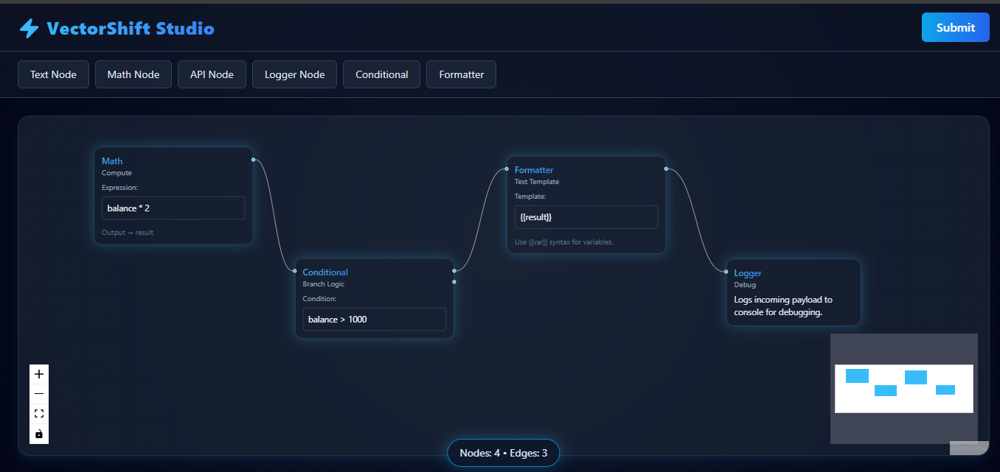

# VectorShift Pipeline Builder

A polished node-based pipeline editor with a neon Tailwind UI frontend and a FastAPI backend. Build, validate and prototype data-processing pipelines using an interactive ReactFlow canvas and a backend DAG validator with a lightweight dashboard at /dashboard.

━━━━━━━━━━━━━━━━━━━━━━━━━━━━━━━━━━━━━━━━━━━━
Key highlights
━━━━━━━━━━━━━━━━━━━━━━━━━━━━━━━━━━━━━━━━━━━━
• Neon-designed Tailwind UI — modern, responsive, and accessible  
• ReactFlow canvas — drag & drop, zoom, pan, and connect nodes  
• Prebuilt node types — Math, API, Formatter, Logger, Conditional  
• Backend validation — NetworkX-based DAG checks and diagnostics  
• Developer-first — modular node engine, TypeScript frontend, FastAPI backend

━━━━━━━━━━━━━━━━━━━━━━━━━━━━━━━━━━━━━━━━━━━━
Quick links
━━━━━━━━━━━━━━━━━━━━━━━━━━━━━━━━━━━━━━━━━━━━
Repository root: ./  
Frontend: ./frontend  
Backend: ./backend — FastAPI + NetworkX  
License: ./LICENSE (MIT)

━━━━━━━━━━━━━━━━━━━━━━━━━━━━━━━━━━━━━━━━━━━━
Visual architecture (overview)
━━━━━━━━━━━━━━━━━━━━━━━━━━━━━━━━━━━━━━━━━━━━
Frontend (React + Vite/TS)
    ├─ ReactFlow canvas (nodes, edges, UI)
    ├─ Zustand store (state & persistence)
    └─ Tailwind neon theme (styles & tokens)

Backend (FastAPI + Python)
    ├─ /validate  -> DAG validation (NetworkX)
    ├─ /execute   -> prototype pipeline runner
    └─ /dashboard -> minimal dashboard UI for pipelines

Optional: containerize both with Docker and use environment secrets for keys.

━━━━━━━━━━━━━━━━━━━━━━━━━━━━━━━━━━━━━━━━━━━━
Impressive Feature Summary
━━━━━━━━━━━━━━━━━━━━━━━━━━━━━━━━━━━━━━━━━━━━
- Live DAG validation with actionable error messages (cycles, disconnected nodes)  
- Extensible node engine: add custom node behaviours easily (sync/async)  
- API-first backend with clear endpoints for validation and execution  
- Dev ergonomics: Fast refresh (Vite), uvicorn reload, and minimal setup

━━━━━━━━━━━━━━━━━━━━━━━━━━━━━━━━━━━━━━━━━━━━
Prerequisites
━━━━━━━━━━━━━━━━━━━━━━━━━━━━━━━━━━━━━━━━━━━━
- Node.js 18.x (LTS recommended)  
- npm or yarn  
- Python 3.10+  
- Git

━━━━━━━━━━━━━━━━━━━━━━━━━━━━━━━━━━━━━━━━━━━━
Installation & Local Dev (copy/paste)
━━━━━━━━━━━━━━━━━━━━━━━━━━━━━━━━━━━━━━━━━━━━
# Clone
git clone https://github.com/gaurav-shinde-07/VectorShift_Pipeline_Builder
cd VectorShift_Pipelines

# Frontend
cd frontend
npm install
npm run dev
# open: http://localhost:5173

# Backend
cd ../backend
python -m venv .venv
# macOS / Linux
source .venv/bin/activate
# Windows (PowerShell)
# .\.venv\Scripts\Activate.ps1
pip install -r requirements.txt
uvicorn main:app --reload --port 8000
# open: http://localhost:8000 and http://localhost:8000/dashboard

━━━━━━━━━━━━━━━━━━━━━━━━━━━━━━━━━━━━━━━━━━━━
Environment variables
━━━━━━━━━━━━━━━━━━━━━━━━━━━━━━━━━━━━━━━━━━━━
Create a .env (backend or root). Example:
PORT=8000
ENV=development
# Add external API keys or DB connection strings as needed

Security: use secret managers for production.

━━━━━━━━━━━━━━━━━━━━━━━━━━━━━━━━━━━━━━━━━━━━
Scripts & Recommended commands
━━━━━━━━━━━━━━━━━━━━━━━━━━━━━━━━━━━━━━━━━━━━
Frontend (frontend/package.json)
- dev: start development server
- build: production bundle
- preview: serve built bundle locally

Backend
- uvicorn main:app --reload --port $PORT
- pytest (once tests are added)

Consider adding:
- linting: ESLint + Prettier (frontend)
- typing checks: TypeScript strict mode and mypy (backend)

━━━━━━━━━━━━━━━━━━━━━━━━━━━━━━━━━━━━━━━━━━━━
Contributing
━━━━━━━━━━━━━━━━━━━━━━━━━━━━━━━━━━━━━━━━━━━━
1. Fork the repo and create a feature branch  
2. Keep changes focused and include tests for new behaviors  
3. Open a PR describing the problem and the solution  
4. Use clear commit messages and follow the repo code style

━━━━━━━━━━━━━━━━━━━━━━━━━━━━━━━━━━━━━━━━━━━━
Project roadmap (suggested)
━━━━━━━━━━━━━━━━━━━━━━━━━━━━━━━━━━━━━━━━━━━━
- Add authentication & per-user pipeline persistence  
- Enhance /execute to support asynchronous, long-running nodes  
- Add visual pipeline test runner and step debugger  
- Integrate CI for linting, tests, and security scanning

━━━━━━━━━━━━━━━━━━━━━━━━━━━━━━━━━━━━━━━━━━━━
Contact
━━━━━━━━━━━━━━━━━━━━━━━━━━━━━━━━━━━━━━━━━━━━  
Author: Gaurav Shinde — gauravmshinde017@gmail.com

━━━━━━━━━━━━━━━━━━━━━━━━━━━━━━━━━━━━━━━━━━━━
Visual assets & screenshots
━━━━━━━━━━━━━━━━━━━━━━━━━━━━━━━━━━━━━━━━━━━━

---